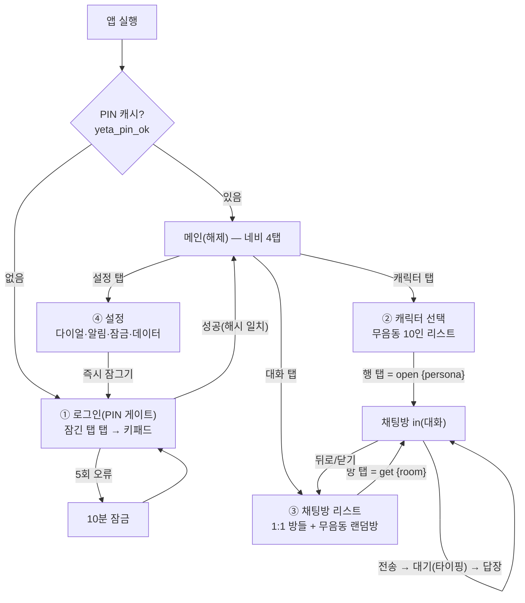

# YETA 기본 채팅 흐름 설계 — 4메뉴 (운영자 260704)

> 지시: "디자인보다 기본 채팅 흐름도 먼저. **로그인 → 채팅 캐릭터 선택 → 채팅방 리스트→채팅방 in(대화) → 설정** — 이 4개 메뉴 구현되면 됨. 사용자는 나 혼자. 세부메뉴는 그다음."
> 이 문서 = 그 4메뉴의 **타깃 흐름·데이터 모델·op 설계·구현 단계** SSOT. 화면 생김새는 페이지 구성도 01~06 계승(재설계 없음).

## 0. 전제

- **단일 사용자**(운영자 1인) — 계정·멀티유저·동시성 없음. 마지막 쓰기 승리.
- **로그인 = PIN 소프트 게이트 유지**(현행 `lk-*` · SHA-256 · 5회=10분 잠금 · localStorage 캐시). 서버측 잠금은 Cloudflare Access 부착 시(후일 · CLAUDE.md §🔑).
- 이미 있는 것 재사용: PIN(구성도 03) · 캐릭터 리스트(04) · 대화방+상태머신(05·06) · 하단 네비 4탭(02 — 캐릭터/대화/설정 자리 예약됨). **신규 = "방(room)" 개념 + 채팅방 리스트 + 설정.**

## 1. 전체 흐름도

- 유저 여정 최단: **PIN → 캐릭터 → 방 in → 대화**. 재방문 최단: **(캐시 통과) → 대화 탭 → 방 탭 → 대화**.
- 기존 딥링크 `?yeta=`(웹푸시) = 마지막 활성 방으로 직행.

## 2. 메뉴별 스펙

| # | 메뉴 | 상태 | 정의 |
|---|---|---|---|
| ① | **로그인** | ✅ 있음(그대로) | 구성도 03. 성공 = `.unlocked`+캐시 · 로그아웃 = 설정 "즉시 잠그기"(캐시 삭제→PIN 재요구) |
| ② | **캐릭터 선택** | 🔁 승격 | 현행 챗 모달 안 리스트뷰(04·`.ypick-row`)를 **캐릭터 탭**에서 상시 진입. 행 탭 = 그 캐릭터 **1:1 방 열기/생성** 후 방 in |
| ③ | **채팅방 리스트 → 방 in** | 🆕 핵심 신규 | 방 = **캐릭터당 1:1 스레드 1개 + 무음동 랜덤방 1개**(아래 §3). 리스트 행 = 아바타+이름+마지막 메시지 1줄+시간(+`state=awaiting` 대기 표시) — `.ypick-row` 계승. 방 in = 현행 대화방(05·06) 그대로, 뒤로 = 리스트 |
| ④ | **설정** | 🆕 최소 4항목 | ⑴ 다이얼 기본값(모델 opus/sonnet × effort — 현행 `YDIAL` 하드코딩 노출) ⑵ 알림(실패 웹푸시 on/off) ⑶ 즉시 잠그기 ⑷ 데이터(방 초기화·전체 초기화 = 2탭 재확인 결) — 세부는 그다음 단계 |

## 3. 방(room) 모델 — 최소 확장

- **roomId = 페르소나 id**(1:1 방) **또는 `main`**(무음동 랜덤방).
- **무음동 랜덤방 = 기존 단일 스레드 그대로 승계**(`sessions/main.json` 무변경·마이그레이션 0). 🎲 재뽑기·화자 교체·sys "합류" 연출은 **이 방 전용**으로 유지 — 기존 컨셉(랜덤 톡방) 보존.
- 1:1 방 = `sessions/rooms/<personaId>.json` 신설. 구조 = 현행 세션 스키마 동일(turns·note·state·awaiting_since).
- **방 목록 인덱스** = `sessions/index.json` — `{rooms:[{id, persona, last(1줄 스냅샷), last_ts, state}]}`. 쓰기 경로(send·open·reset·답장 착지)마다 갱신 → 리스트 화면 = 폴 1회로 그림(방마다 N회 GET 방지).

## 4. API(op) 설계 — `functions/api/yeta.js`

하위호환 원칙: **`room` 생략 = `main`** → 기존 뷰어·스크립트 무수정 동작.

| op | 변경 | 내용 |
|---|---|---|
| `rooms {}` | 🆕 | `sessions/index.json` 반환(없으면 main만 합성) |
| `open {persona}` | 🆕 | 1:1 방 없으면 생성(+greeting 턴 박제) → sess 반환 · 있으면 그대로 반환 |
| `get {room?}` | 확장 | 해당 방 세션 반환 |
| `send {room?, text, model, effort}` | 확장 | 해당 방 턴 append + `state=awaiting` + dispatch(payload에 room) |
| `retry {room?}` / `reset {room?}` | 확장 | 방 단위 재발사/초기화(reset은 1세대 백업 유지) |
| `draw {persona}` | 유지 | **main 방 전용**(화자 교체). 1:1 방에선 미사용 |
| `warm {}` | 유지 | 프리웜(방 무관 러너 선부팅) |

- **러너**: `yeta-chat.yml` dispatch payload에 `room` 추가 → `yeta_chat.sh`가 그 방 파일 읽고/쓰기(세션 키 파라미터화 1곳). 웜 루프 = P0에선 현행(단일 사용자·동시 방 대화 희박), P1에서 pending 방 스캔.
- 일 상한(`YETA_MAX_PER_DAY`) = **전 방 합산**(현행 quota 키 그대로).
- ⚠️ 불변: 대화는 R2만 — **레포 커밋 금지**(§📰).

## 5. 뷰 구조 — P0는 최소 변경

- 하단 네비 4탭 = 이미 있는 자리에 매핑: **메인 / 캐릭터 / 대화 / 설정**(잠금 해제 후 전부 활성).
- 챗 모달(`#yetadlg`) 유지 + 내부 뷰 1개 추가: `_yView = 'rooms' | 'list'(캐릭터) | 'chat'`.
  - 캐릭터 탭 → 모달 열고 `list` · 대화 탭 → 모달 열고 `rooms` · 방/행 탭 → `chat`.
  - 방 리스트 행·헤더 = CII 정본 계승(`.ypick-row`·`.yeta-h`·`.tool-x`) — 새 컴포넌트 창작 0.
- 설정 = 신규 `dialog`(CII "모달/팝업" 행 계승 · pushState·뒤로가기=닫기).
- (P1 선택) 모달 → 탭 화면 SPA 승격 — 지금 안 함: 모달+pushState가 폰 뒤로가기 UX를 이미 해결.

## 6. 구현 단계

- **P0 (4메뉴 완성)**: ① yeta.js op 확장(rooms/open/room 파라미터+index 갱신) ② yeta_chat.sh room 파라미터화 ③ 뷰 rooms 리스트 + 탭 배선 ④ 설정 모달 4항목. — 이거면 지시 범위 끝.
- **P1**: 안읽음 뱃지 · 방별 pending 스캔 웜 · 설정 세부(PIN 변경·무드 토글·방 삭제).
- 병행 불변: 디자인 = 구성도 01~06 계승(다크·네온레몬) · 대화 커밋 금지 · `--bare` 금지.

## 7. 운영자 확인 2개 (이것만 답하면 P0 착수)

1. **방 모델 OK?** — 캐릭터당 1:1 방 1개 + 무음동 랜덤방 1개(🎲는 랜덤방 전용). 캐릭터당 다중 방은 세부메뉴 단계로 미룸.
2. **P0 바로 구현 들어갈까?** — 순서: ops → 인덱스 → 뷰 → 설정.
